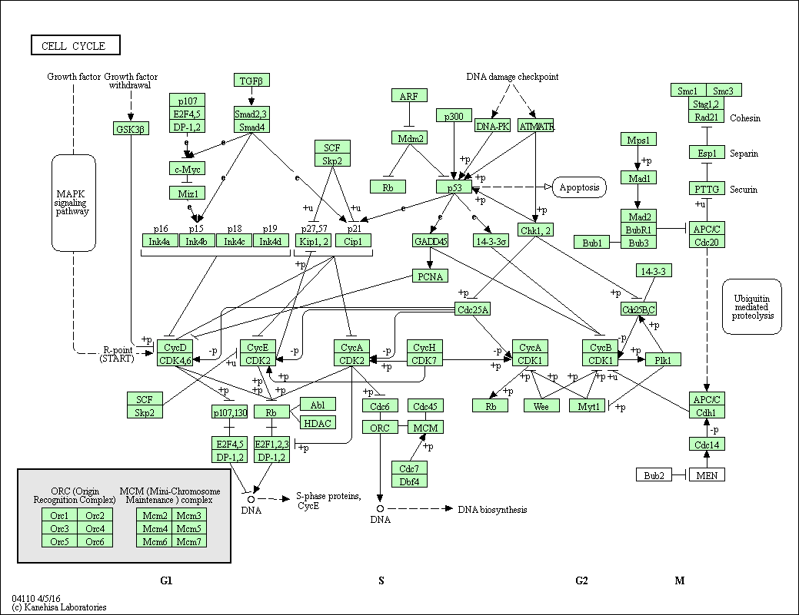
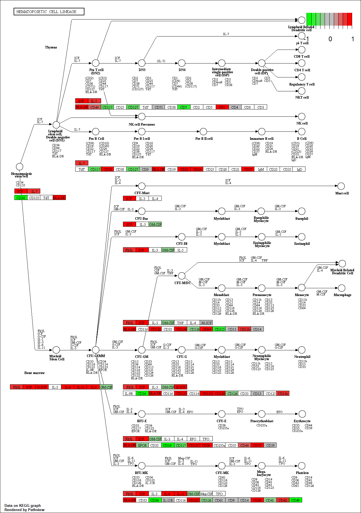

```{r setup, include=FALSE}
knitr::opts_chunk$set(echo = TRUE)
```

#2_27 Lecture

Hands On sheet: https://bioboot.github.io/bimm143_W18/class-material/lecture15_BIMM143_W18/

##Pathway analysis with R & Bioconductor

###Section 1. Differential Expression Analysis
```{r}
library(DESeq2)
metaFile <- "~/Rstudio stuff/GSE37704_metadata.csv"
countFile <- "~/Rstudio stuff/GSE37704_featurecounts.csv"

# Import metadata and take a peak
colData<- read.csv(metaFile, row.names=1)
head(colData)
```
```{r}
countData = read.csv(countFile, row.names = 1)
head(countData)
```

Right now countData and colData are not matching up. We need to remove the first odd column in countData: contData$length
```{r}
countData <-as.matrix(countData[,-1])
head(countData)
```
This looks better but there are still a lot of 0 entries so let's get rid of those because we have no data for these.
```{r}
#Filter count data where you read count 0 across all samples
#This sets countData to only rows that are not all 0
countData = countData[rowSums(countData)>1,]
head(countData)
```

Now to set up DESeqDataSet object required for DESeq() function and then run the DESeq pipeline.
```{r}
dds = DESeqDataSetFromMatrix(countData = countData, colData = colData, design=~condition)
dds = DESeq(dds)
dds
```

Next get results for the HoxA1 knockdown versus control siRNA.
```{r}
res = results(dds, contrast = c("condition", "hoxa1_kd", "control_sirna"))
```

Reorder by p-value and call a summary to get a sense of how many up/down regulated genes at default FDR of 0.1.
```{r}
res = res[order(res$pvalue),]
summary(res)
```

Our data right now is mapped to Ensemble annotation and so only has Ensemble gene IDs. Our pathway analysis downstream will use KEGG pathways wich use Entrez gene IDs. So lets add them as we did the previous lecture.
```{r}
library("AnnotationDbi")
library("org.Hs.eg.db")

columns(org.Hs.eg.db)
```

```{r}
res$symbol = mapIds(org.Hs.eg.db,
                    keys=row.names(res), 
                    column="SYMBOL",
                    keytype="ENSEMBL",
                    multiVals="first")

res$entrez = mapIds(org.Hs.eg.db,
                    keys=row.names(res), 
                    column="ENTREZID",
                    keytype="ENSEMBL",
                    multiVals="first")

res$name =   mapIds(org.Hs.eg.db,
                    keys=row.names(res), 
                    column="GENENAME",
                    keytype="ENSEMBL",
                    multiVals="first")

head(res, 10)
```

###Pathway Analysis
####KEGG Pathways
First install and load bioconductor packages
```{r}
source("https://bioconductor.org/biocLite.R")
biocLite(c("pathview", "gage", "gageData"))
```

Load data:
```{r}
library(pathview)
library(gage)
library(gageData)

data(kegg.sets.hs)
data(sigmet.idx.hs)

kegg.sets.hs = kegg.sets.hs[sigmet.idx.hs]
head(kegg.sets.hs,3)
```

The main gage() function requires a named vector of fold changes where the names of the values are Entrex gene IDs.
```{r}
foldchanges = res$log2FoldChange
names(foldchanges) = res$entrez
head(foldchanges)
```

Check the documentation for gage().
```{r}
# Get results
keggres = gage(foldchanges, gsets = kegg.sets.hs, same.dir = TRUE)
attributes(keggres)
#head(keggres$greater)
head(keggres$less)
```

keggresgreater and keggresless are data matrices with gene sets for rows sorted by p-value. Try using lapply()
```{r}
lapply(keggres, head)
```

Now to process the results to pull out the top 5 upregulated pathways, then further process that just to get the Ids. We'll use the KEGG pathway IDs downstream for plotting.
```{r}
##Sanity check displaying all pathways data
pathways= data.frame(id=rownames(keggres$greater), keggres$greater)
head(pathways)
```

Now lets try pathview() function from pathview package to make a pathway plot.
```{r}
pathview(gene.data = foldchanges, pathway.id="hsa04110")
```


This downloads the pathway figure data from KEGG and adds our results to it. You can play with other input args in pathview() to change display and make a PDF graph. Example:
```{r}
# A different PDF based output of the same data
pathview(gene.data=foldchanges, pathway.id="hsa04110", kegg.native=FALSE)
```


Now let's proces the results a bit more to automagially pull out top 5 upregulated pathways, process IDs, graph with pathview().
```{r}
## Focus on top 5 upregulated pathways here for demo purposes only
keggrespathways <- rownames(keggres$greater)[1:5]

# Extract the Ids part of each string
keggresids = substr(keggrespathways, start=1, stop=8)
keggresids
```

Pass these IDs to pathview() to draw plot.
```{r}
pathview(gene.data = foldchanges, pathway.id=keggresids, species = "hsa")
```


###Section 3. Gene Ontology
We can also do a similar pipeline with gene ontology. Similar to above, go.sets.hs has all GO terms. go.subs.hs is a named list containing indexes for the BP, CC , anMF ontologies. Let's do only Biological Process.
```{r}
data(go.sets.hs)
data(go.subs.hs)
gobpsets = go.sets.hs[go.subs.hs$BP]

gobpres = gage(foldchanges, gsets=gobpsets, same.dir=TRUE)

lapply(gobpres, head)
```

###Section 4. Reactome Pathway Analysis
First install the reactome package:
https://bioconductor.org/packages/release/bioc/html/ReactomePA.html
```{r}
sig_genes <- res[res$padj <= 0.05 & !is.na(res$padj), "symbol"]
print(paste("total number of significant genes:", length(sig_genes)))
```

```{r}
write.table(sig_genes, file="significant_genes.txt", row.names = FALSE, col.names = FALSE, quote = FALSE)
```
Now to perform Reactome pathway analysis, go to the Reactome website and upload your significant_genes.txt file.
Select params "Project to Humans"

###Section 5. GO Analysis
The goal of this analysis is to determine the biological process the given set of genes are associated with.
To perform Gee Set GO Enrichment online go to their website:
http://www.geneontology.org/page/go-enrichment-analysis
Paste your significant gene list from Section 4, params "bioloigcal process", "homo sapiens"
